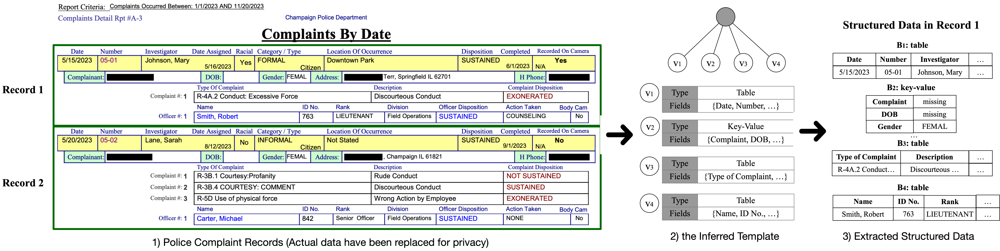

<!-- **Structure-aware Document Analytics** -->

The vast majority (over 80%) of today’s data exists in unstructured formats, with documents representing a major portion. When analyzing documents, current systems treat them as plain text sent to AI models (e.g., LLMs) for synthesis, ignoring underlying structures and thus leading to limited accuracy and performance. In contrast, we explored ***document structures*** and demonstrate that discovering them can significantly improve downstream analytics. In particular, we exhaustively explore and identify three types of document structures that encompass most real-world documents we have encountered: ***form-like templatized documents, hierarchically structured documents, and loose-metadata documents.*** For each type of document, we develop tools or systems to process them effectively for analytics. 

 

**1. Form-Like Templatized Documents.**

One common type of documents are programmatically generated from structured data following the same visual template, such as invoices and tax documents, etc. Effective data extraction from these documents is crucial for accurate analytics. Current data extraction tools struggle with complex document layouts, incur high latency and/or cost on large datasets. 

We develop [TWIX (SIGMOD 2026)](https://arxiv.org/abs/2501.06659), a tool that infers the underlying template used to generate documents and extracts data based on this template rather than directly from the documents. TWIX first identifies fields (e.g., table columns or key–value pairs) by leveraging consistent location patterns (e.g., fields in the same template repeatedly co-occur across records), and then assembles them into a template by enforcing visual constraints (e.g., vertically aligning table rows with their column headers). Once the template is inferred, it decomposes a complex document into simple records sharing the same template, making downstream data extraction *entirely free and fast*, without LLM calls. TWIX outperforms state-of-the-art structured data extraction tools (e.g., Azure Document Intelligence), and vision-based LLMs like GPT-4-Vision, by ***over 25% in precision and recall on a benchmark with 34 diverse real-world datasets, and 520× faster and 3,786× cheaper than the most competitive compared tool***. Check our latest [blog for TWIX](https://data-people-group.github.io/blogs/2025/04/30/twix/). 

**2. Hierarchical Structured Documents.**

Another type of document contains semantic hierarchical structures, where hierarchies (e.g., section and subsection headers) form a tree-like structure, commonly seen in scientific and legal documents, etc. Consider: what is the most effective way for humans to read a 1,000-page document? An intuitive answer is to <u>*read the table of contents to locate the relevant chapter.*</u> 

 

Inspired by this intuition, we develop [ZenDB (ICDE 2025)](https://arxiv.org/abs/2405.04674), a full-stack data management system, to construct such a "table of contents" for hierarchically structured documents, enabling LLMs to traverse this structure and pinpoint the relevant document portions for retrieval. Unlike RAG (Retrieval-Augmented Generation), which retrieves physically partitioned document chunks, ZenDB understands the semantic structure of documents, enabling highly accurate retrieval: ***up to 61% higher precision and 81% higher recall than RAG at a marginally higher cost.***

 

While ZenDB is our first try to build hierarchical structures, our subsequent project, SHED, explores how to *theoretically construct a correct* structure and identify the classes of documents for which it applies. Instead of inferring the true structure, which is often unrealistic due to semantic ambiguities in documents, we define a *recall-safe* structure that guarantees the retrieved document portions are a *superset of the true ones* (i.e., no true answers are missed) when used for retrieval, which is sufficient to ensure correctness for many analytical tasks. In particular, we develop *a family of approaches, each guaranteed to return a recall-safe structure* for a specific class of documents. We further *theoretically establish the sufficient conditions under which a recall-safe structure can be inferred for each document class.* 

**3. Loose-Metadata Documents.**

The last type of document is neither programmatically generated, as explored in TWIX, nor cleanly hierarchical, as in ZenDB or SHED. Instead, it contains only a list of metadata, such as headers of semantic document portions, with a loose structure. Our ongoing project LSF aims to reduce the cost of large-scale document analytics while matching the accuracy of top-tier LLMs (e.g., GPT-5) by leveraging minimally available metadata.

Consider a toy example where the task is to extract author names from one million scientific papers. After using top-tier LLMs as oracles on a small sample, we observe that author names consistently appear either *on the first page beneath the title* or *in the text between the title and the Introduction or Abstract.* LSF constructs a structure that captures this *consistent pattern* across documents by leveraging metadata, semantics, and appearance order within each document.

To handle collections lacking shared patterns for a given task (e.g., a mixed collection of scientific papers and medical records), LSF clusters the documents such that those within the same cluster exhibit consistent patterns, and then solves the problem for each cluster separately.

**4. Structure-based Document Clustering.**

A document collection provided by users or applications may contain a mixture of structures—*form-like*, *hierarchically structured*, or *loose-metadata* documents. We are developing methods to ***cluster documents based on their structures*** into one of these three types so that the corresponding tools can be used to process each class of documents.

With this, we construct a ***complete document ingestion pipeline*** capable of processing documents with diverse structures, producing either clean structured data or accurate retrieval results for downstream analytical tasks. Notably, the extracted structures themselves are insightful by-products, offering ample opportunities for further optimization.

**Project Impact** 

This line of research about document analytics has already produced several open-source projects (such as [TWIX](https://github.com/ucbepic/TWIX) with over 200 Github stars within one month of release). It helps our collaborators process over **9,600 pages** of court dispositions with CA Public Defenders, **6,500+ pages** of civic reports and invoices with journalists at Stanford’s Big Local News, and **4,300+ pages** of police use-of-force and employee records with the CA Police Records CLEAN team, transforming heterogeneous documents into structured data.  

---

